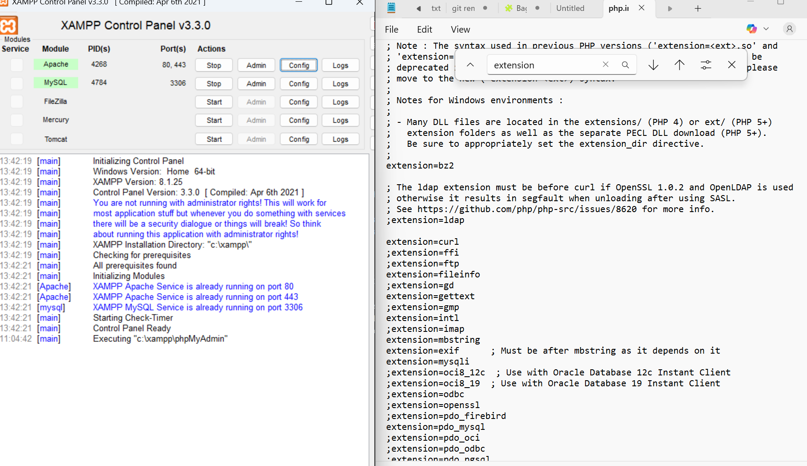
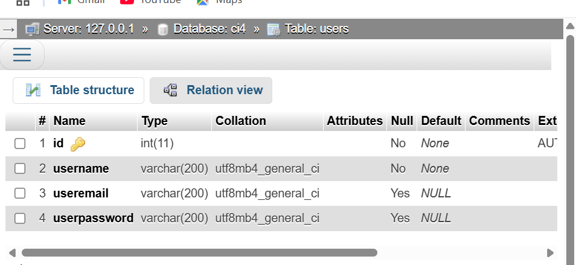
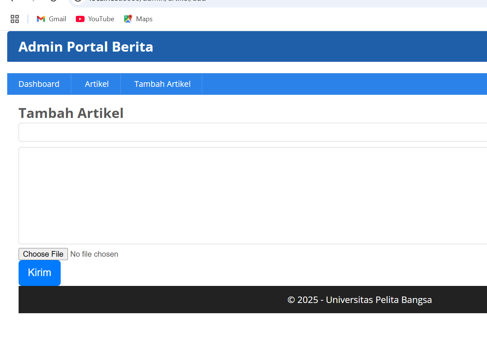
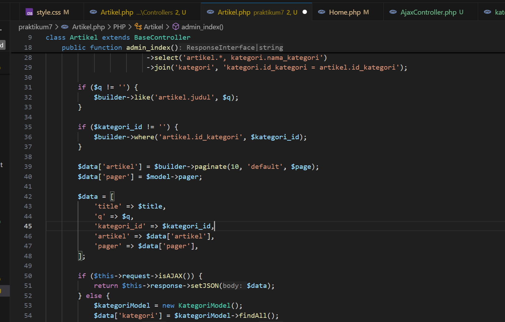

# Praktikum PHP CodeIgniter 4

## Praktikum 1: PHP Framework (Codeigniter)


### Langkah - langkah Praktikum
#### A. Persiapan
    Untuk memulai dengan CodeIgniter4 perlu konfigurasi beberapa ekstensi PHP seperti berikut:
    1. php-json ekstension untuk bekerja dengan JSON;
    2. php-mysqlnd native driver untuk MySQL;
    3. php-xml ekstension untuk bekerja dengan XML;
    4. php-intl ekstensi untuk membuat aplikasi multibahasa;
    5. libcurl (opsional), jika ingin pakai Curl.
Buka XAMPP, lalu pada bagian Apache klik **Config**, pilih **PHP.ini**. Untuk mengaktifkan konfigurasi hilangkan tanda **;** pada setiap eksitensi yang diaktifkan.



#### B. Instal CodeIgniter4


#### C. Menjalankan CLI (Command Line Interface)
Buka cmd/terminal, lalu arahkan pada direktori projek yang dibuat. Jalankan perintah untuk memanggil CLI Codeigniter:
```CLI
    php spark
```


#### D. Mengaktifkan Mode Debugging
Mengubah nama file **env** menjadi **.env**, selanjutnya buka file tersebut dan ubah nilai **CI_ENVIRONTMENT** menjadi **development**, dan hilangkan tanda **#**.


Berikut setelah mengaktifkan Mode Debugging, maka akan menampilkan pesan error.


#### E. Membuat Route Baru
Menambahkan kode berikut ini di file **Routes.php**
```php
    $routes->get('/', 'Home::index');
    $routes->get('/about', 'Page::about');
    $routes->get('/contact', 'Page::contact');
    $routes->get('/faqs', 'Page::faqs');
```

Cek Route yang ditambahkan, dan jalankan perintah berikut :
```php
    php spark routes
```


Untuk dapat mengakses, aktifkan dulu **localhost:8080** dengan menjalankan perintah berikut:
```php
    php spark serve
```


Lakukan akses route yang telah dibuat dengan mengakses alamat url
**http://localhost:8080/about**


#### F. Membuat Controller
Buat file baru dengan nama **page.php** pada
direktori Controller kemudian isi kodenya seperti berikut.
```php
    <?php
    namespace App\Controllers;
    class Page extends BaseController
    {
        public function about()

        {
            echo "Ini halaman About";
        }
            public function contact()
        {
            echo "Ini halaman Contact";
        }
            public function faqs()
        {
        echo "Ini halaman FAQ";
        }
    }
```

Maka akan menampilkan hasil halaman yang sudah dapat diakses.


#### G. Auto Routing
Untuk mengubah status autoroute
dapat mengubah nilai variabelnya. Untuk menonaktifkan ubah nilai **true** menjadi **false**.
```php
    $routes->setAutoRoute(true);
```

Tambahkan method baru pada Controller Page seperti berikut.
```php
    public function tos()
    {
        echo "ini halaman Term of Services";
    } 
```
    
Method ini belum ada pada **routing**, sehingga cara mengaksesnya dengan menggunakan
alamat: **http://localhost:8080/page/tos**


#### H. Membuat View
Buat file baru dengan nama **about.php** pada direktori view **(app/view/about.php)** kemudian isi kodenya seperti berikut.
```php
    <!DOCTYPE html>
    <html lang="en">
    <head>
        <meta charset="UTF-8">
        <title><?= $title; ?></title>
    </head>
    <body>
        <h1><?= $title; ?></h1>
        <hr>
        <p><?= $content; ?></p>
    </body>
    </html>
```
Ubah **method about** pada class **Controller Page** menjadi seperti berikut:

```php
    public function about()
    {
        return view('about', [
            'title' => 'Halaman About',
            'content' => 'Ini adalah halaman about yang menjelaskan tentang isi halaman ini.'
        ]);
    }
```


#### I. Membuat Layout Web dengan CSS
Pada Codeigniter 4 file yang menyimpan asset css dan javascript terletak pada direktori **public**.Buat file css pada direktori public dengan nama **style.css**

Kemudian buat folder template pada direktori view kemudian buat file **header.php** dan **footer.php**
File **app/view/template/header.php**
```php
    <!DOCTYPE html>
    <html lang="en">
    <head>
        <meta charset="UTF-8">
        <!-- Tambahkan di bagian head -->
    <meta name="csrf-token" content="<?= csrf_hash() ?>">
        <title><?= $title; ?></title>
        <link rel="stylesheet" href="<?= base_url('/style.css');?>">
    </head>
    <body>
        <div id="container">
        <header>
            <h1>Layout Sederhana</h1>
        </header>
        <nav>
            <a href="<?= base_url('/');?>" class="active">Home</a>
            <a href="<?= base_url('/artikel');?>">Artikel</a>
            <a href="<?= base_url('/about');?>">About</a>
            <a href="<?= base_url('/contact');?>">Kontak</a>
        </nav>
        <section id="wrapper">
            <section id="main">
```
File **app/view/template/footer.php**
```php
    </section>
            <aside id="sidebar">
                <div class="widget-box">
                    <h3 class="title">Widget Header</h3>
                    <ul>
                        <li><a href="#">Widget Link</a></li>
                        <li><a href="#">Widget Link</a></li>
                    </ul>
                </div>
                <div class="widget-box">
                    <h3 class="title">Widget Text</h3>
                    <p>Vestibulum lorem elit, iaculis in nisl volutpat, malesuada tincidunt arcu. Proin in leo fringilla, vestibulum mi porta, faucibus felis. Integer pharetra est nunc, nec pretium nunc pretium ac.</p>
                </div>
            </aside>
        </section>
        <footer>
            <p>&copy; 2021 - Universitas Pelita Bangsa</p>
        </footer>
        </div>
    </body>
    </html>
```
Kemudian ubah file **app/view/about.php** seperti berikut.
```php
    <?= $this->include('template/header'); ?>
    <h1><?= $title; ?></h1>
    <hr>
    <p><?= $content; ?></p>
    <?= $this->include('template/footer'); ?>
```
Selanjutnya refresh tampilan pada alamat **http://localhost:8080/about**


## Praktikum 2: Framework Lanjutan (CRUD)
### Langkah - langkah Praktikum
#### A. Persiapan
Untuk memulai membuat aplikasi CRUD sederhana, yang perlu disiapkan adalah database server menggunakan MySQL. Pastikan MySQL Server sudah dapat dijalankan melalui XAMPP.

#### B. Membuat Database dan Tabel Artikel
```sql
    CREATE DATABASE ci4;
```

```sql
    CREATE TABLE artikel (
        id INT(11) auto_increment,
        judul VARCHAR(200) NOT NULL,
        isi TEXT,
        gambar VARCHAR(200),
        status TINYINT(1) DEFAULT 0,
        slug VARCHAR(200),
        PRIMARY KEY(id)
    );
```


#### C. Konfigurasi Koneksi Database
Membuat konfigurasi untuk menghubungkan dengan database server, menggunakan file **.env**. Pada praktikum ini kita gunakan konfigurasi pada file env.


#### D. Membuat Model
Membuat Model untuk memproses data Artikel. Buat file baru pada direktori **app/Models** dengan nama **ArtikelModel.php**.


#### E. Membuat Controller
Buat Controller baru dengan nama **Artikel.php** pada direktori **app/Controllers**.


#### F. Membuat View
Buat direktori baru dengan nama **artikel** pada direktori **app/views**, kemudian buat file baru dengan nama **index.php**.


Selanjutnya buka browser kembali, dengan mengakses url http://localhost:8080/artikel


Belum ada data yang diampilkan. Kemudian coba tambahkan beberapa data pada database agar dapat ditampilkan datanya.
```sql
    INSERT INTO artikel (judul, isi, slug) VALUE
    ('Artikel pertama', 'Lorem Ipsum adalah contoh teks atau dummy dalam industri percetakan dan penataan huruf atau typesetting. Lorem Ipsum telah menjadi standar contoh teks sejak tahun 1500an, saat seorang tukang cetak yang tidak dikenal mengambil sebuah kumpulan teks dan mengacaknya untuk menjadi sebuah buku contoh huruf.', 'artikel-pertama'), ('Artikel kedua', 'Tidak seperti anggapan banyak orang, Lorem Ipsum bukanlah teks-teks yang diacak. Ia berakar dari sebuah naskah sastra latin klasik dari era 45 sebelum masehi, hingga bisa dipastikan usianya telah mencapai lebih dari 2000 tahun.', 'artikel-kedua');
```
Refresh kembali browser, sehingga akan ditampilkan hasilnya.


#### G. Membuat Tampilan Detail Artikel
Tampilan pada saat judul berita di klik maka akan diarahkan ke halaman yang berbeda.
Tambahkan fungsi baru pada **Controller Artikel** dengan nama **view()**.


#### H. Membuat View Detail
Buat view baru untuk halaman detail dengan nama **app/views/artikel/detail.php**


#### I. Membuat Routing untuk artikel detail
Buka kembali file **app/config/Routes.php**, kemudian tambahkan routing untuk artikel detail.
```php
    $ruotes->get('/artikel/(:any)', 'Artikel::view/$1');
```


#### J. Membuat Menu Admin
Menu admin adalah untuk proses CRUD data artikel. Buat method baru pada **Controller Artikel** dengan nama **admin_index()**.
```php
    public function admin_index()
    {
        $title = 'Daftar Artikel';
        $model = new ArtikelModel();
        $artikel = $model->findAll();
        return view('artikel/admin_index', compact('artikel', 'title'));
    }
```
Selanjutnya buat view untuk tampilan admin dengan nama **admin_index.php**


Tambahkan Routing untuk menu admin seperti berikut:


Akses menu admin dengan URL http://localhost:8080/admin/artikel


#### K. Menambah Data Artikel
Tambahkan Fungsi/method baru pada **Controller Artikel** dengan nama **add()**.


Kemudian buat view untuk form tambah dengan nama **form_add.php**.


#### L. Mengubah Data
Tambahkan Fungsi/method baru pada **Controller Artikel** dengan nama **edit()**.


Kemudian buat view untuk form tambah dengan nama **form_edit.php**


#### M. Menghapus Data
Tambahkan Fungsi/method baru pada **Controller Artikel** dengan nama **delete()**.
```php
    public function delete($id)
    {
        $artikel = new ArtikelModel();
        $artikel->delete($id);
        return redirect('admin/artikel');
    }
```
## Praktikum 3: View Layout dan View Cell
### Tujuan
Setelah menyelesaikan praktikum ini, mahasiswa diharapkan dapat:
1. Memahami konsep View Layout di CodeIgniter 4.
2. Menggunakan View Layout untuk membuat template tampilan.
3. Memahami dan mengimplementasikan View Cell dalam CodeIgniter 4.
4. Menggunakan View Cell untuk memanggil komponen UI secara modular.
### Langkah-langkah Praktikum
Praktikum kali ini kita akan mengunakan konsep View Layout dan View Cell untuk memudahkan dalam penggunaan layout.
#### A. Membuat Layout Utama
Buat folder **layout** di dalam **app/Views/**
Buat file **main.php** di dalam folder **layout** dengan kode berikut:


#### B. Modifikasi File View
Ubah **app/Views/home.php** agar sesuai dengan layout baru, sesuaikan juga untuk halaman lainnya yang ingin menggunakan format layout baru.


#### C. Membuat Class View Cell
Buat folder **Cells** di dalam **app/**
Buat file **ArtikelTerkini.php** di dalam **app/Cells/** dengan kode berikut


#### D. Membuat View untuk View Cell
Buat folder **components** di dalam **app/Views/**
Buat file **artikel_terkini.php** di dalam **app/Views/components/** dengan kode berikut:


### Pertanyaan dan Tugas
#### 1. Apa manfaat utama dari penggunaan View Layout dalam pengembangan aplikasi?

Manfaat utama dari penggunaan View Layout dalam pengembangan aplikasi adalah:

1. **Konsistensi Tampilan**: View Layout memastikan semua halaman memiliki struktur dan tampilan yang konsisten.
2. **Pemisahan Konten dan Layout**: Memisahkan konten spesifik halaman dari struktur layout umum, sehingga kode lebih terorganisir.
3. **Penggunaan Kembali Kode (Reusability)**: Layout yang sama dapat digunakan oleh banyak halaman tanpa perlu menulis ulang kode.
4. **Pemeliharaan yang Lebih Mudah**: Perubahan pada layout cukup dilakukan di satu tempat dan akan berlaku untuk semua halaman yang menggunakannya.
5. **Pengembangan yang Lebih Cepat**: Pengembang dapat fokus pada konten halaman tanpa perlu mengulang-ulang kode layout.

#### 2. Jelaskan perbedaan antara View Cell dan View biasa.

Perbedaan antara View Cell dan View biasa:

1. **Fungsi dan Tujuan**:

- **View Biasa**: Digunakan untuk menampilkan halaman lengkap atau bagian dari halaman.
- **View Cell**: Digunakan untuk membuat komponen UI yang dapat digunakan ulang dan bersifat modular.

2. **Cara Pemanggilan**:

- **View Biasa**: Dipanggil dengan `return view('nama_view', $data)` atau `echo view('nama_view', $data)`.
- **View Cell**: Dipanggil dengan `<?= view_cell('Namespace\\Class::method', $params) ?>`.

3. **Logika Bisnis**:

- **View Biasa**: Biasanya tidak memiliki logika bisnis, hanya menerima data dari controller.
- **View Cell**: Dapat memiliki logika bisnis sendiri, seperti mengambil data dari database.
4. **Penggunaan Kembali**:

- **View Biasa**: Dapat digunakan kembali dengan include/extend, tetapi kurang fleksibel.
- **View Cell**: Dirancang khusus untuk komponen yang digunakan berulang kali di berbagai halaman.

5. **Isolasi**:

- **View Biasa**: Berbagi konteks dengan view yang memanggilnya.
- **View Cell**: Memiliki konteks tersendiri, terisolasi dari view yang memanggilnya.
#### 3. Ubah View Cell agar hanya menampilkan post dengan kategori tertentu.
Modifikasi pada method render() di class **ArtikelTerkini.php**


Memanggil View Cell dengan parameter kategori di layout


## Praktikum 4: Framework Lanjutan (Modul Login)
### Langkah-langkah Praktikum
Untuk memulai membuat modul Login, yang perlu disiapkan adalah database server menggunakan MySQL. Pastikan MySQL Server sudah dapat dijalankan melalui XAMPP.
#### A. Membuat Tabel User
```php
    CREATE TABLE user (
        id INT(11) auto_increment,
        username VARCHAR(200) NOT NULL,
        useremail VARCHAR(200),
        userpassword VARCHAR(200),
        PRIMARY KEY(id)
    );
```


#### B. Membuat Model User
Selanjutnya adalah membuat Model untuk memproses data Login. Buat file baru pada direktori **app/Models** dengan nama **UserModel.php**


#### C. Membuat Controller User
Buat Controller baru dengan nama **User.php** pada direktori **app/Controllers**. Kemudian tambahkan method **index()** untuk menampilkan daftar user, dan method **login()** untuk proses login.


#### D. Membuat View Login
Buat direktori baru dengan nama **user** pada direktori **app/views**, kemudian buat file baru dengan nama **login.php**.


#### E. Membuat Database Seeder
Database seeder digunakan untuk membuat data dummy. Untuk keperluan ujicoba modul login, kita perlu memasukkan data user dan password kedaalam database. Untuk itu buat database seeder untuk tabel user. Buka CLI,kemudian tulis perintah berikut:
```CLI
    php spark make:seeder UserSeeder
```
Selanjutnya, buka file **UserSeeder.php** yang berada di lokasi direktori **/app/Database/Seeds/UserSeeder.php** kemudian isi dengan kode berikut:

Selanjutnya buka kembali CLI dan ketik perintah berikut
```CLI
    php spark db:seed UserSeeder
```

#### F. Uji Coba Login
Selanjutnya buka url http://localhost:8080/user/login seperti berikut:


#### G. Membuat Auth Filter
Selanjutnya membuat filer untuk halaman admin. Buat file baru dengan nama **Auth.php** pada direktori **app/Filters**.


Selanjutnya buka file **app/Config/Filters.php** tambahkan kode berikut:
```php
    public array $aliases = [
        'csrf'          => CSRF::class,
        'toolbar'       => DebugToolbar::class,
        'honeypot'      => Honeypot::class,
        'auth'          => \App\Filters\Auth::class, 
    ];
```
Selanjutnya buka file **app/Config/Routes.php** dan sesuaikan kodenya.


#### H. Percobaan Akses Menu Admin
Buka url dengan alamat http://localhost:8080/admin/artikel ketika alamat tersebut diakses
maka, akan dimuculkan halaman login.


#### I. Fungsi Logout
Tambahkan method logout pada Controller User seperti berikut:
```php
    public function logout()
    {
        session()->destroy();
        return redirect()->to('/user/login');
    }
```
## Praktikum 5: Pagination dan Pencarian
### Langkah-langkah Praktikum
#### A. Membuat Pagination
Pagination merupakan proses yang digunakan untuk membatasi tampilan yang panjang dari data yang banyak pada sebuah website. Fungsi pagination adalah memecah tampilan menjadi beberapa halaman tergantung banyaknya data yang akan ditampilkan pada setiap halaman.
Untuk membuat pagination, buka Kembali **Controller Artikel**, kemudian modifikasi kode
pada method **admin_index** seperti berikut.


Kemudian buka file **views/artikel/admin_index.php** dan tambahkan kode berikut dibawah deklarasi tabel data.
```php
    <?= $pager->links(); ?>
```
Selanjutnya buka kembali menu daftar artikel, tambahkan data lagi untuk melihat
hasilnya.

#### B. Membuat Pencarian
Untuk membuat pencarian data, buka kembali **Controller Artikel**, pada method
**admin_index** ubah kodenya seperti berikut


Kemudian buka kembali file **views/artikel/admin_index.php** dan tambahkan form
pencarian sebelum deklarasi tabel seperti berikut:


Pada link pager ubah seperti ini:
```php
    <?= $pager->only(['q'])->links(); ?>
```
Selanjutnya ujicoba dengan membuka kembali halaman admin artikel, masukkan kata kunci tertentu pada form pencarian.


## Praktikum 6: Upload File Gambar
### Langkah-langkah Praktikum
#### A. Upload Gambar pada Artikel
Buka kembali **Controller Artikel** pada project sebelumnya, sesuaikan kode pada method **add** seperti berikut:


Kemudian pada file **views/artikel/form_add.php** tambahkan field input file seperti
berikut.
```php
    <p>
        <input type="file" name="gambar">
    </p>
```
Sesuaikan tag form dengan menambah encrypt type seperti berikut:
```php
    <form action="" method="post" enctype="multipart/form-data">
```
Ujicoba file upload dengan mengakses menu tambah artikel.

#### A.
#### A.
#### A.

## Praktikum 7: Relasi Tabel dan Query Builder
### Langkah-langkah Praktikum
#### A. Membuat Tabel Kategori
Kita akan membuat tabel baru bernama **kategori** untuk mengkategorikan artikel.
Struktur Tabel **kategori**:


Jalankan query berikut:
```sql
    CREATE TABLE kategori (
            id_kategori INT(11) AUTO_INCREMENT,
            nama_kategori VARCHAR(100) NOT NULL,
            slug_kategori VARCHAR(100),
            PRIMARY KEY (id_kategori)
        );
```


#### B. Mengubah Tabel Artikel
Tambahkan foreign key **id_kategori** pada tabel **artikel** untuk membuat relasi dengan tabel
**kategori**.
Query untuk menambahkan foreign key:
```sql
    ALTER TABLE artikel
    ADD COLUMN id_kategori INT(11),
    ADD CONSTRAINT fk_kategori_artikel
    FOREIGN KEY (id_kategori) REFERENCES kategori(id_kategori);
```


#### C. Membuat Model Kategori
Buat file model baru di **app/Models** dengan nama **KategoriModel.php**:


#### D. Memodifikasi Model Artikel
Modifikasi **ArtikelModel.php** untuk mendefinisikan relasi dengan **KategoriModel**:

Menambahkan method `getArtikelDenganKategori()` untuk mengambil data artikel beserta
nama kategorinya menggunakan join.

#### E. Memodifikasi Controller Artikel
Modifikasi **Artikel.php** untuk menggunakan model baru dan menampilkan data relasi:


#### F. Memodifikasi View
Buka folder view/artikel sesuaikan masing-masing view. **index.php**


**admin_index.php**


**form_add.php**


**form_edit.php**


## Praktikum 8: AJAX
### Langkah-langkah Praktikum
#### A. Menambahkan Pustaka jQuery
Kita akan menggunakan pustaka jQuery untuk mempermudah proses AJAX. Download pustaka jQuery versi terbaru dari https://jquery.com dan ekstrak filenya.
Salin file **jquery-3.6.0.min.js** ke folder **public/assets/js**.

#### B. Membuat Model
Pada modul sebelumnya sudah dibuat ArtikelModel, pada modul ini kita akan memanfaatkan model tersebut agar dapat diakses melalui AJAX.

#### C. Membuat AJAX Controller


#### D. Membuat View


## Praktikum 9: Implementasi AJAX Pagination dan Search
### Langkah-langkah Praktikum
#### A. Persiapan 
* Pastikan MySQL Server sudah berjalan.
* Buka database **`lab_ci4`**.
* Pastikan tabel **`artikel`** dan **`kategori`** sudah ada dan terisi data.
* Pastikan library jQuery sudah terpasang atau dapat diakses melalui CDN.
#### B. Modifikasi Controller Artikel
Ubah method **`admin_index()`** di **`Artikel.php`** untuk mengembalikan data dalam format JSON jika request adalah AJAX. 


**Penjelasan:**
• `$page = $this->request->getVar('page') ?? 1;`: Mendapatkan nomor
halaman dari request. Jika tidak ada, default ke halaman 1.
• `$builder->paginate(10, 'default', $page);`: Menerapkan pagination
dengan nomor halaman yang diberikan.
• `$this->request->isAJAX()`: Memeriksa apakah request yang datang adalah
AJAX.
• Jika AJAX, kembalikan data artikel dan pager dalam format JSON.
• Jika bukan AJAX, tampilkan view seperti biasa.
#### C. Modifikasi View (admin_index.php)
* Ubah view **`admin_index.php`** untuk menggunakan jQuery.
* Hapus kode yang menampilkan tabel artikel dan pagination secara langsung.
* Tambahkan elemen untuk menampilkan data artikel dan pagination dari AJAX.
* Tambahkan kode jQuery untuk melakukan request AJAX.


## Praktikum 10: API
### Langkah-langkah Praktikum
#### A. Persiapan
Persiapan awal adalah mengunduh aplikasi REST Client, ada banyak aplikasi yang dapat digunakan untuk keperluan tersebut. Salah satunya adalah Postman. Postman – Merupakan aplikasi yang berfungsi sebagai REST Client, digunakan untuk testing REST API. Unduh aplikasi Postman dari tautan berikut:
https://www.postman.com/downloads/
#### B. Membuat Model
Pada modul sebelumnya sudah dibuat ArtikelModel, pada modul ini kita akan memanfaatkan model tersebut agar dapat diakses melalui API.
#### C. Membuat REST Controller
Pada tahap ini, kita akan membuat file REST Controller yang berisi fungsi untuk menampilkan,
menambah, mengubah dan menghapus data. Masuklah ke direktori **app\Controllers** dan buatlah file
baru bernama **Post.php**. Kemudian, salin kode di bawah ini ke dalam file tersebut:


Kode diatas berisi 5 method, yaitu:
• **index()** – Berfungsi untuk menampilkan seluruh data pada database.
• **create()** – Berfungsi untuk menambahkan data baru ke database.
• **show()** – Berfungsi untuk menampilkan suatu data spesifik dari database.
• **update()** – Berfungsi untuk mengubah suatu data pada database.
• **delete()** – Berfungsi untuk menghapus data dari database.

#### D. Membuat Routing REST API
Untuk mengakses REST API CodeIgniter, kita perlu mendefinisikan route-nya terlebih dulu.
Caranya, masuklah ke direktori **app/Config** dan bukalah file **Routes.php**. Tambahkan kode di bawah ini:
```php
    $routes->resource('post');
```
Untuk mengecek route nya jalankan perintah berikut:
```CLI
    php spark routes
```
Selanjutnya akan muncul daftar route yang telah dibuat.


#### E.Testing REST API CodeIgniter
Buka aplikasi postman dan pilih create new → HTTP Request


#### F. Menampilkan Semua Data
Pilih method **GET** dan masukkan URL berikut: http://localhost:8080/post.
Lalu, klik Send. Jika hasil test menampilkan semua data artikel dari database, maka pengujian berhasil.


#### G. Menampilkan Data Spesifik
Masih menggunakan method **GET**, hanya perlu menambahkan ID artikel di belakang URL
seperti ini:
http://localhost:8080/post/2
Selanjutnya, klik **Send**. Request tersebut akan menampilkan data artikel yang memiliki ID nomor **2** di database.


#### H. Mengubah Data
Untuk mengubah data, silakan ganti method menjadi **PUT**. Kemudian, masukkan URL artikel
yang ingin diubah. Misalnya, ingin mengubah data artikel dengan ID nomor 2, maka masukkan
URL berikut:
http://localhost:8080/post/2

Selanjutnya, pilih tab **Body**. Kemudian, pilih **x-www-form-uriencoded**. Masukkan nama atribut tabel pada kolom **KEY** dan nilai data yang baru pada kolom **VALUE**. Kalau sudah, klik **Send**.


#### I. Menambahkan Data
Anda perlu menggunakan method **POST** untuk menambahkan data baru ke database. Kemudian, masukkan URL berikut:
http://localhost:8080/post
Pilih tab **Body**, lalu pilih **x-www-form-uriencoded**. Masukkan atribut tabel pada kolom **KEY** dan nilai data baru di kolom **VALUE**. Jangan lupa, klik **Send**.


#### J. Menghapus Data
Pilih method **DELETE** untuk menghapus data. Lalu, masukkan URL spesifik data mana yang ingin di hapus. Misalnya, ingin menghapus data nomor 4, maka URL-nya seperti ini:
http://localhost:8080/post/7

Langsung saja klik **Send**, maka akan mendapatkan pesan bahwa data telah berhasil dihapus dari database.


